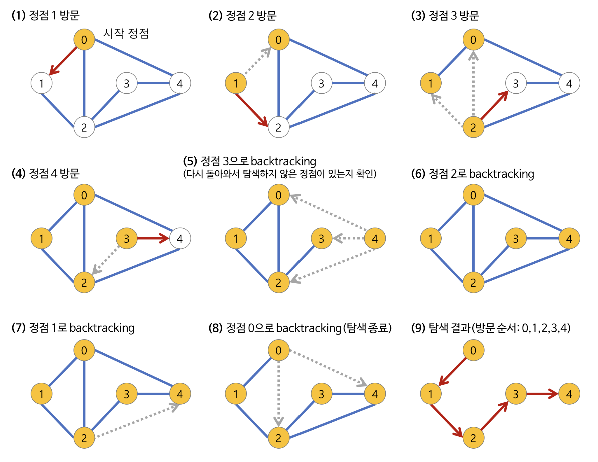

# Depth-First Search (DFS)
<p align="center">

</p>

**Depth-First Search (이하 DFS)** 란 root 노드(혹은 다른 임의의 노드)에서 시작해서 다음 분기(branch)로 넘어가기 전에 해당 분기를 완벽하게 탐색하는 방법.

## Pseudocode
### Recursive implementation
```bash
procedure DFS(G, v) is
    label v as discovered
    for all directed edges from v to w that are in G.adjacentEdges(v) do
        if vertex w is not labeled as discovered then
            recursively call DFS(G, w)
```
[Go to python code](./recursive.py)

### Stack implementation

```bash
procedure DFS_iterative(G, v) is
    let S be a stack
    S.push(v)
    while S is not empty do
        v = S.pop()
        if v is not labeled as discovered then
            label v as discovered
            for all edges from v to w in G.adjacentEdges(v) do 
                S.push(w)
```
[Go to python code](./stack.py)


## Features
- 모든 노드를 방문하고자 하는 경우에 이 방법을 선택한다.
- 단순 검색 속도자체는 **BFS**에 비해 느리다.
- 자기 자신을 호출하는 **recursive algorithm** 형태를 가지고 있다.
- 전위 순회(Pre-Order Traversals)를 포함한 다른 형태의 Tree Traversal 는 모두 DFS의 한종류이다.
- 그래프 탐색의 경우 어떤 노드를 방문했었는지 여부를 반드시 검사해야 한다. 그렇지 않으면 무한루프에 빠질 위험이 있다.

## Algorithm Flow
<p align="center">

</p>

1. a 노드를 방문한다. (방문한 노드 체크)
2. a 노드와 인접한 노드를 차례로 순회한다. 이때 인접한 노드가 없다면 종료한다.
3. a와 이웃한 노드 b를 방문했다면, a와 인접한 또 다른 노드를 방문하기 전에 b의 이웃 노드들을 전부 방문해야한다.
    - b를 시작노드로 DFS를 다시 시작하여 b의 이웃 노드들을 방문한다.
4. b의 분기를 전부 완벽하게 탐색했다면 다시 a에 인접한 정점들 중에서 아직 방문이 안된 정점을 찾는다.
    - 아직 방문이 안된 노드가 있으면 다시 그 정점을 기준으로 DFS를 시작한다. 만약 없으면 종료


## Complexity
- `N`: Node 의 갯수
- `E`: Edge 의 갯수

||Time|Space|
|:---|:---:|:---:|
|Adjection Graph (worst case)|$O(N+E)$|$O(N)$|

## Applications
- web crawling

## Reference
- [https://gmlwjd9405.github.io/2018/08/15/algorithm-bfs.html](https://gmlwjd9405.github.io/2018/08/15/algorithm-bfs.html) 
- [https://en.wikipedia.org/wiki/Breadth-first_search](https://en.wikipedia.org/wiki/Breadth-first_search)

