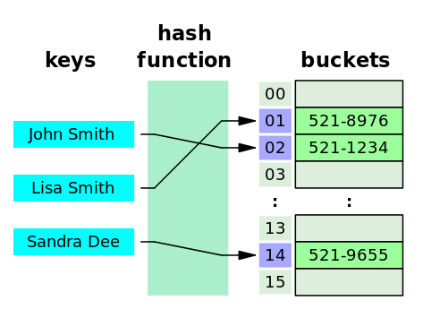

# Hash

|keyword|Description|
|:---|:---|
|Hash|임의 값을 고정 길이로 변환하는 것을 의미|
|Hash function|특정 연산을 이용하여 키 값을 받아서 value를 가진 공간의 주소로 바꾸어주는 함수를 의미|
|Hash value|Key값을 해쉬 함수에 넣어서 얻은 주소값을 의미|
|Hash table|Hash 구조를 사용하는 데이터 구조|
|Slot(bucket)|한 개의 데이터를 저장할 수 있는 공간을 의미|
|SHA|Secure Hash Algorithm 으로 어떤 데이터도 고정된 크기의 유일한 값으로 리턴|

## Hash Table
<p align="center">

</p>

- 해쉬 테이블(Hash Table)이란 키(Key)와 값(Value)쌍으로 이루어진 데이터 구조를 의미한다.
- 파이썬에서는 딕셔너리(Dictionary)타입이 해쉬 테이블과 같은 구조이다.
- 기본적으로는 배열로 미리 Hash Table 크기만큼 생성해서 사용한다. 공간은 많이 사용하지만 시간이 빠르다는 장점이 있다.
- 검색이 많이 필요한 경우, 저장/삭제/읽기가 많은 경우, 캐쉬를 구현할 때 주로 사용된다.
    ### 장점
    - 데이터 저장/검색 속도가 빠르다.
    - 키의 중복확인이 쉽다.
    ### 단점
    - 일반적으로 저장공간이 좀더 필요하다
    - 여러 키에 해당하는 주소가 동일할 경우 충돌을 해결하기 위한 별도의 자료구조가 필요
    ### 시간 복잡도
    - 일반적인 경우(충돌이 없는 경우): $O(1)$
    - 최악의 경우(모든 경우에 충돌이 발생한 경우): $O(n)$

```bash
[PYTHONHASHSEED=0]  python HashTable.py
```