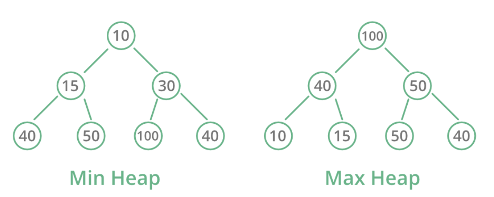
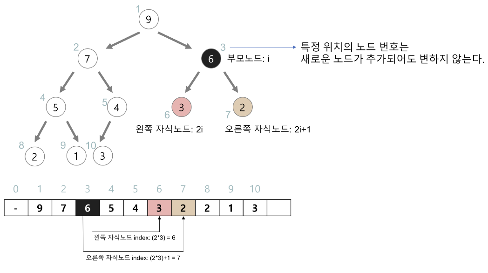

# 힙(Heap)

- 완전 이진 트리(Complete Binary Tree)의 일종으로 **우선순위 큐(Priority Queue)** 를 위하여 만들어진 자료구조이다. 
- 여러 개의 값들 중에서 최댓값/최솟값을 빠르게 찾아내도록 만들어진 자료구조이다. 
- 힙은 일종의 반정렬 상태(느슨한 정렬 상태)를 유지한다. 
- 힙 트리에서는 중복된 값을 허용한다.

## 구현

- 힙을 저장하는 표준적인 자료구조는 배열(array)이다.
- 구현을 쉽게 하기 위하여 배열의 첫 번째 인덱스인 0은 사용되지 않는다.
- 특정 위치의 노드 번호는 새로운 노드가 추가 되어도 변하지 않는다. (예를 들어 루트 노드의 오른쪽 노드의 번호는 항상 3이다.)
- 힙에서의 부모 노드와 자식 노드의 관계:
    - 왼쪽 자식의 인덱스 = (부모의 인덱스) * 2
    - 오른쪽 자식의 인덱스 = (부모의 인덱스) * 2 + 1
    - 부모의 인덱스 = (자식의 인덱스) / 2
