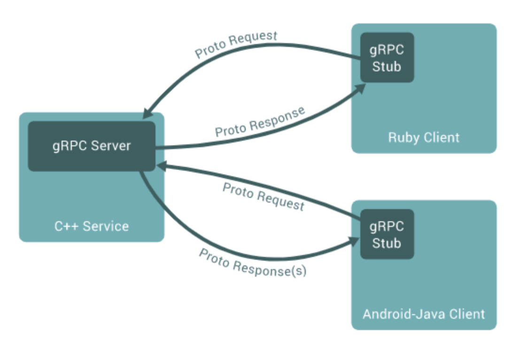

## gRPC 
<p align="center">

</p>

> RPC(Remote Procedure Call): 별도의 원격 제어를 위한 코딩 없이 다른 주소 공간에서 함수나 프로시저를 실행할 수 있게하는 프로세스 간 통신 기술

gRPC는 구글에서 개발한 어느 환경에서 실행할 수 있는 고성능 RPC 프레임워크이다. gRPC를 이용하면 원격에 있는 어플리케이션의 메서드를 로컬 메서드인 것 처럼 직접 호출할 수 있기 때문에 분산 어플리세견과 서비스를 보다 쉽게 만들 수 있다.

### Stub
Stub은 PRC의 핵심 개념으로 **Parameter 객체를 Message로 Marshalling/Unmarshalling하는 레이어**이다. 서버와 클라이언트는 서로 다른 주소 공간을 사용하므로 함수 호출에 사용된 매개 변수를 꼭 변환해주어야 한다. 그렇지 않으면 메모리 매개 변수에 대한 포인터가 다른 데이터를 가리키게 되기 때문이다. 
- client의 stub은 함수 호출에 사용된 파라미터 변환(marshalling)및 함수 실행 후 서버에서 전달된 결과의 변환 담당
- server의 stub은 클라이언트가 전달한 매개 변수의 역변환(unmarshalling) 및 함수 실행 결과 변환을 담당

### PB(Protocol Buffer)
gRPC는 IDL(Interface Definition Language)로 PB를 사용한다.
PB는 직렬화 데이터 구조이다. 직렬화 종류에는 대표적으로 `json`, `xml` 등이 있다.

PB로 작업할 때는 `proto file` 에서 직렬화하려는 데이터 구조를 정의한다. PB 데이터는 일련의 *type, key, value* 의 쌍을 포함하는 작은 논리적인 레코드 `message`로 구성된다.
```proto
message Person {
    string name = 1;
    int32 id = 2;
    string gender = 3;
}
```
이렇게 작성된 `proto file`을 `protoc compiler`로 컴파일하면 데이터에 접근할 수 있는 각 언어에 맞는 형태의 데이터 클래스를 생성해준다.

### 주요 특징
- 높은 생산성과 다양한 언어 및 플랫폼 지원

    gRPC는 서비스와 `message`를 정의하기 하기 위해 PB를 사용한다. PB의 IDL만 정의하면 서비스와 `message`에 대한 소스코드가 자동으로 생성되고 데이터를 주고 받을 수 있다.
- HTTP/2 기반의 양방향 스트리밍:
    
    gRPC는 HTTP/2기반으로 통신한다. HTTP/2는 하나의 TCP 연결이 여러 개의 양방향 스트리밍을 지원한다.

- 성능 이점:

    gRPC는 HTTP/2 레이어 위에서 PB를 사용해 직렬화된 바이트 스트림으로 통신하여 JSON기반의 통신보다 더 가볍고 속도가 빠르다. 그래서 Latency 감소와 더 많은 트래픽을 처리할 수 있는 성능의 이점이 있다.


## Example


### Env. Setup
- python >= 3.7

```bash
pip install -r requirements.txt
```

### proto buffer compile
Following command will generate `_pb2_grpc.py`, `_pb2.py`, `pb2.pyi` files.
```bash
python run_codegen.py
```

### Server

```bash
python [async_]server.py 
```


### client
```bash
python [async_]client.py 
```