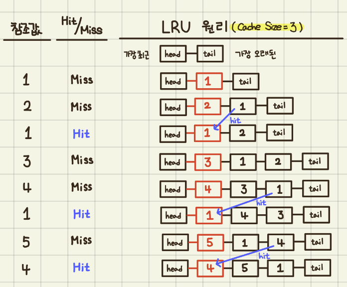

# Least Recent Used(LRU) Cache
<p align="center">

</p>
LRU cache can be implemented using two data structure:

- Double Linked List

- Hash Map


## Test LRU cache
```bash
python lru_cache.py
```

# Reference
- [https://dailylifeofdeveloper.tistory.com/355](https://dailylifeofdeveloper.tistory.com/355)