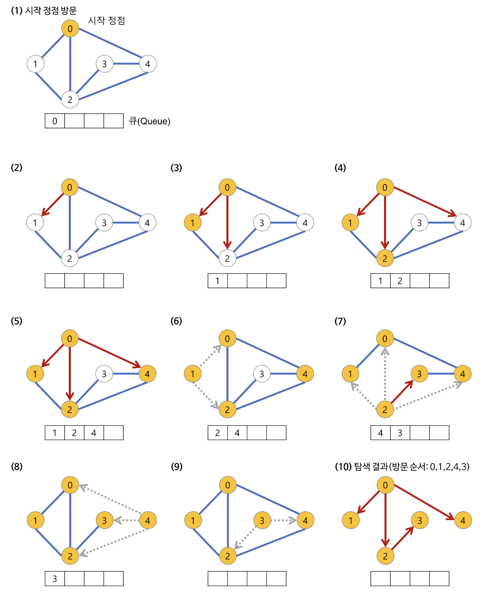

# Breadth First Search (BFS)

## Test Algorithms

- [basic](./main.py)
- [binary tree](./binary_tree.py)


## Concepts
<p align="center">

</p>

**Breadth First Search (이하 BFS)** 란 root 노드(혹은 다른 임의의 노드)에서 시작해서 인접한 노드를 먼저 탐색하는 방법이다. 


### Features
- 두 노드 사이의 최단 경로 혹은 임의의 경로를 찾고 싶을 때 이 방법을 사용한다. 
- 재귀적으로 동작하지 않는 것은 **Depth-First Search(DFS)** 알고리즘과 유사하지만 구현할 때 **DFS** 와의 차이점이 두가지 존재한다: 
    1. 그래프 탐색의 경우 어떤 노드를 방문 했었는지 여부를 반드시 검사해야한다.
    2. 방문한 노드들을 차례로 저장한 후 꺼낼 수 있는 자료 구조인 **Queue** 를 사용한다.

- `Prim`, `Dijkstra` 알고리즘과 유사하다는 특징이 있다.

### Algorithm Flow
<p align="center">

</p>

1. 시작 노드를 방문한다. (방문한 노드 체크)
    - Queue 에 방문된 노드를 삽입(Enqueue)한다.
    - 초기 상태의 Queue 에는 시작 노드만이 저장
2. Queue 에서 꺼낸 노드와 인접한 노드들을 모두 차례로 방문한다.
    - Queue 에서 꺼낸 노드를 방문한다.
    - Queue 에서 꺼낸 노드와 인접한 노드들을 모두 방문한다.
        - 이때 인접한 노드가 없다면 큐의 앞에서 모드를 꺼낸다(Dequeue).
    - Queue 에 방문된 노드를 삽입한다. 
3. 큐가 소진될 때까지 계속한다.

### Pseudocode
- input: A graph G and a starting node root of G
- Output: Goal state. The parent links trace the shortest path back to root

```bash
procedure BFS(G, root) is
    let Q be a queue
    label root as explored
    Q.enqueue(root)
    while Q is not empty do
        v := Q.dequeue()
        if v is the goal then
            return v
        for all edges from v to w in G.adjacentEdges(v) do
            if w is not labeled as explored then
                label w as explored
                w.parent := v
                Q.enqueue(w)
```


## Complexity
- `N`: Node 의 갯수
- `E`: Edge 의 갯수

||Time|Space|
|:---|:---:|:---:|
|Adjection Graph (worst case)|$O(N+E)$|$O(N)$|


## Reference
- [https://gmlwjd9405.github.io/2018/08/15/algorithm-bfs.html](https://gmlwjd9405.github.io/2018/08/15/algorithm-bfs.html) 
- [https://en.wikipedia.org/wiki/Breadth-first_search](https://en.wikipedia.org/wiki/Breadth-first_search)