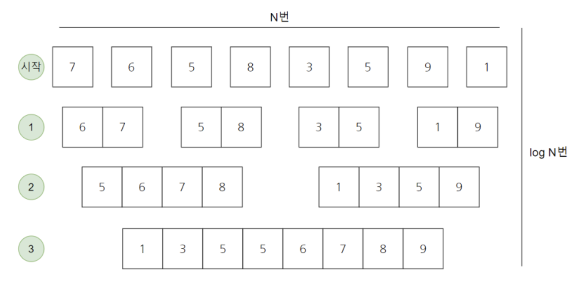

# Merge Sort

### Run Algorithm
```bash
python main.py
```
## Concepts

<p align="center">

</p>


**Merge sort** 알고리즘은 **Divide & Conquer** 알고리즘 중 하나로써 문제를 작은 2개의 문제로 분리하고 각각 해결한 다음 결과를 모아서 원래의 문제를 해결하는 전략이다.


### Algorithm Flow
1. 리스트의 길이가 0 또는 1이면 이미 정렬된 것으로 본다.
2. 그렇지 않은 경우, 정렬되지 않은 리스트를 절반으로 잘라 비슷한 크기의 두 부분 리스트로 나눈다.
3. 각 부분 리스트를 재귀적으로 **merge sort** 를 이용해 정렬한다.
4. 두 부분 리스트를 다시 하나의 정렬된 리스트로 병합한다.

### Complexity
<p align="center">

</p>
<!-- <a href="https://m.blog.naver.com/ndb796/221227934987" align="center">
<figure>

<figcaption >From. 안경잡이 개발자</figcaption>
</figure>
</a> -->

**Merge Sort** 는 합치는 순간에 정렬을 수행한다. 수행단계가 증가할수록 합치는 리스트의 길이가 2배씩 증가하기 때문에 수행단계의 깊이는 `log(N)` 이다. 또한 각 단계별로 정렬 자체에 필요한 수행시간은 `N` 이므로 총 시간 복잡도는 `O(N * logN)`이다.
> 각 단계별로 정렬하는데 `N` 번만 걸리는 이유는 삽입 정렬과 비슷하게 부분 집합 리스트가 이미 정렬이 되어 있는 상태라고 가정하기 때문이다. 이미 정렬되어 있는 것 두개를 합치는 것은 시간 복잡도 `O(N)` 이다.

||Time Complexity|
|:---|:---:|
|BEST|`O(N * logN)`|
|AVG.|`O(N * logN)`|
|WORST|`O(N * logN)`|


### Pros 
- 데이터의 분포에 영향을 덜 받는 안정적인 정렬 방법
- **Linked List** 로 구성하면, 링크 인덱스만 변경하면되므로 제자리 정렬(in-place sorting)로 구현할 수 있다.

### Cons
- 리스트의 크기가 큰 경우에는 이동 횟수가 많으므로 리소스 낭비가 있을 수 있다.
- 정렬되는 배열은 `전역 변수`로 선언해야한다. 
    > 만약 함수 안에서 배열을 선언하게 된다면 매번 새로운 배열을 선언해야 한다는 점에서 메모리 자원의 낭비가 커질 수 있다.
- 기존의 데이터를 담을 추가적인 배열 공간이 필요하다. (메모리 활용성이 떨어진다.)

### References
- [Wikipedia](https://en.wikipedia.org/wiki/Merge_sort)
- [안경잡이개발자 블로그](https://m.blog.naver.com/ndb796/221227934987)
- [gmlwjd9405 블로그](https://gmlwjd9405.github.io/2018/05/08/algorithm-merge-sort.html)